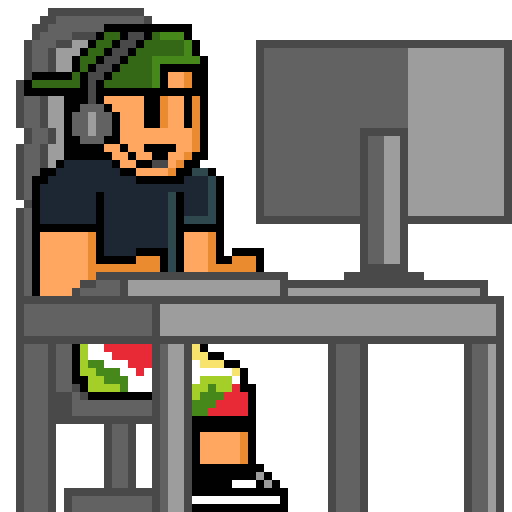

<h1 align="center"> STILL UNDER CONSTRUCTION!.</h1>

 

<h1 align="center">Hi 👋, I'm Ricardo!FrontEnd Developer Jr.</h1>

<h2 align="center">About Me </h2> 

With the intention of returning to what I am most passionate about, and after some years of experience in other sectors, I have once again focused on my training and growth as a FrontEnd Developer. My goal is to master the technologies of HTML, CSS and JavaScript, as well as React.

This year 2023 I have dedicated myself to making a complete remake of my Github and portfolio in order to show you my knowledge and skills.

- 🌱 I’m currently learning **React**

- 💬 Ask me about **HTML, CSS, SCSS, VanillaJS**

- 📫 How to reach me **rhalmoguera@gmail.com**

<h3 align="left">Connect with me:</h3>

<h3 align="left">Languages and Tools:</h3>

       

&nbsp;

